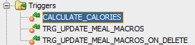

# Database Analytical and Design Documentation

## 1. Introduction

### 1.1 Document Purpose
The purpose of this document is to provide analytical and design documentation for the diet system's database. The document includes data model descriptions, ERD diagrams, and detailed descriptions of tables, indexes, relationships, stored procedures, triggers, and views.

### 1.2 Scope
This document covers:
- Logical data model
- Relational data model
- Description of stored triggers
- Indexes used in DB

## 2. System Description

### 2.1 General System Description
Featured system is an application, aiming to serve as a comprehensive tool to track diet, monitor calorie intake, and record exercise routines, allowing users to set their goals and helping to achieve them. All of these goals are achieved by linking our application to a database that contains detailed information about the user.

## 3. Logical Model

### 3.1 Table Diagrams

### 3.2 Table and Column Descriptions

#### Table `User`
- **Description**: Stores information about system users including name, surname, email etc. as well as the user's encrypted password.

#### Table `Activity Entry`
- **Description**: Serves as a table for holding user's activity information.

#### Table `Activity`
- **Description**: Defines different types of activities.

#### Table `Body Measurement Entry`
- **Description**: Stores information about users' weight on a given day.

#### Table `Meal Entry`
- **Description**: The table stores information about the time at which the meal was eaten.

#### Table `Meal`
- **Description**: Contains meal macronutrients and calories.

#### Table `Meal Type`
- **Description**: Stores meal types in our DB like breakfast dinner etc.

#### Table `Meal Food`
- **Description**: Links meals with food. A single meal can contain multiple foods.

#### Table `Food`
- **Description**: Stores information about food. Information about food and its micronutrients was obtained using the API from [Edamam](https://www.edamam.com/).

#### Table `Goal`
- **Description**: The table stores information about user goals and their target completion dates.

#### Table `Goal Type`
- **Description**: Defines goal types in our DB like loose weight, gain mass.

## 4. Relational Model

### 4.1 Relational Schema

### 4.2 Descriptions of relationships in the database
- The user in our database is connected with multiple entries:
    - **Activity Entry**: contains reference to
        - **Activity** table so that we can calculate calories burned by the user based on the duration of the activity and the calories_per_hour field.
    - **Body Measurement Entry**: links the user with his/her weight and date.
    - **Meal Entry**: contains reference to:
        - **Meal**, which is then linked with the **Food** table using **Meal_Food** to calculate calories and macronutrients using a special trigger
        - **Meal** also contains reference to **Meal_Type** table so that we know whether the meal was eaten for breakfast, dinner, etc.
    - **Goal**: describes the user's goal by linking with **Goal_Type** table which contains information on whether the user wants to gain mass, improve health, etc.

## 5. Triggers
### Triggers used in our DB:

#### CALCULATE_CALORIES
- **Description**
- This trigger is activated when we insert or update data in our **Activity Entry** table. It fetches data about activity calories from the **Activity** entity and then calculates *calories_burned* based on the duration of activity(given in seconds).
- **Warning**
If the user wants to manually insert how many calories he/she burned, this trigger is not activated.

#### TRG_UPDATE_MEAL_MACROS
- **Description**
- This trigger is crucial when we want to add new food to our meal using **Meal_Food** table. It fetches data using *food_id* field and then updates meal info.

#### TRG_UPDATE_MEAL_MACROS_ON_DELETE
- **Description**
- As the name suggests - this trigger is activated when we want to remove food from our meal by deleting row from the **Meal_Food** table. All macronutrients for the meal are subtracted, which were previously retrieved from the food table for the given dish.