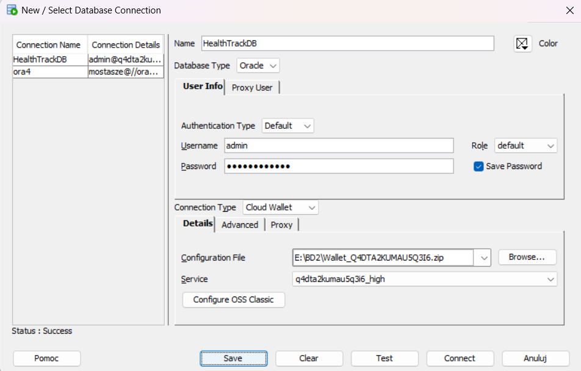

In order to connect to our cloud DB, we need to:
- Set the login as: admin
- In the password field, type: BD2zespol26#
- Leave the authentication type and role as default
- Choose cloud wallet as the Connection type
- For the Configuration File, choose the Wallet_Q4DTA2KUMAU5Q3I6.zip file

Then click Save and Connect

