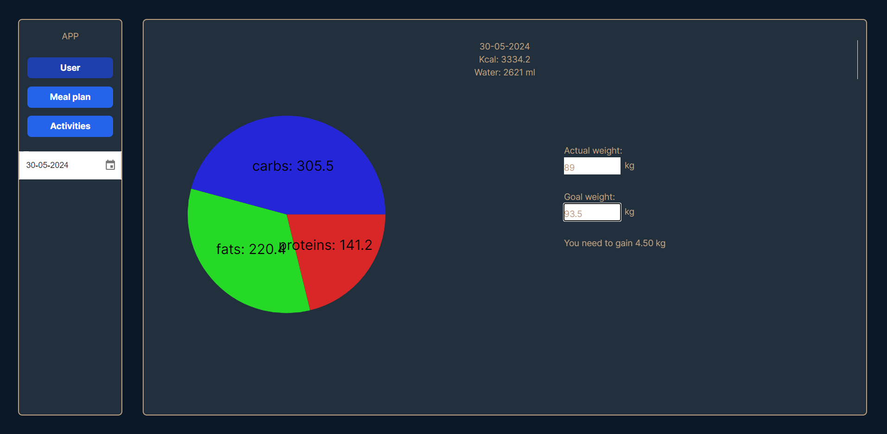
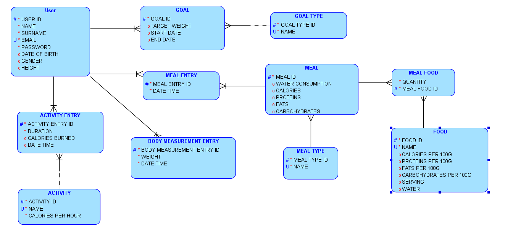
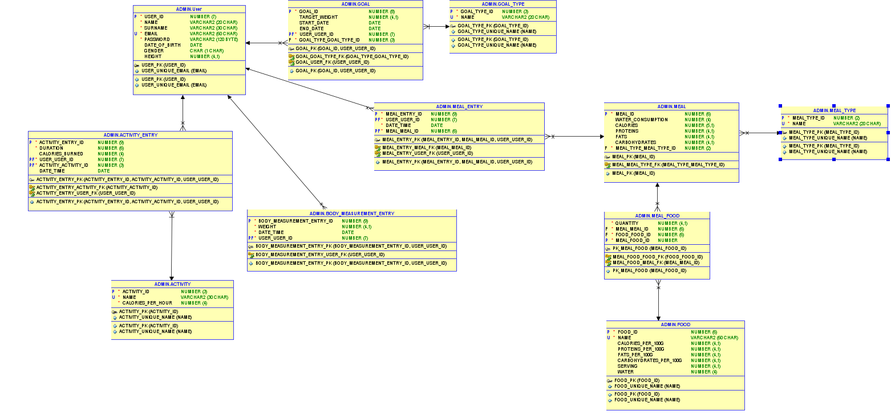

# Health Tracker

## Scope
**This document covers:**
- [General Project Description](#general-project-description)
- [Visuals](#visuals)
- [Used Technologies](#used-technologies)
- [How to Run](#how-to-run)
- [Database Description](#database-description)
    - [Logical Data Model](#1-logical-model)
    - [Relational Data Model](#2-relational-model)
    - [Description of Stored Triggers](#3-triggers)
    - [Indexes Used in Database](#4-indexes)
- [Authors](#authors)

## General Project Description
Health Tracker is a web application designed to serve as a comprehensive tool for tracking diet, monitoring calorie intake, and recording exercise routines. It allows users to set their fitness goals and helps them achieve these goals by linking the application to a database containing detailed information about the user.

### Key features

- User account with personal data and daily macro targets
- Adding meals and tracking macros and calories
- Tracking exercises
- Setting fitness goals
- Adding body measurements

## Visuals

### Main Window - User

### Meal Plan

### Activity

## Used Technologies

The Health Tracker application leverages a range of modern technologies for both its backend and frontend components, as well as for database management. Below is a detailed description of the technologies used in this project:

### DataBase
- Oracle Cloud Autonomous Data Warehouse: This serves as the primary database for the Health Tracker application.
- SQL Developer with Data Modeler: Used for database modeling and management.
### Backend
- Python
- Flask: Is used to create the server and handle HTTP requests.
- oracledb: Is used to connect the backend application to the Oracle DB.
- bcrypt: Used for password hashing and encryption.
### Frontend
- Node.ts
- React
- CSS
- tailwind

## How to run
**npm is required.**
### Installation
    npm run install:frontend
    npm run install:backend

### Build
    npm run build:frontend

### Run
    npm run start
**Enter http://localhost:3000/ in your web browser.**

## DB Discription

### 1. Logical Model

#### 1.1 Table Diagrams

#### 1.2 Table and Column Descriptions

##### Table `User`
- **Description**: Stores information about system users including name, surname, email etc. as well as the user's encrypted password.

##### Table `Activity Entry`
- **Description**: Serves as a table for holding user's activity information.

##### Table `Activity`
- **Description**: Defines different types of activities.

##### Table `Body Measurement Entry`
- **Description**: Stores information about users' weight on a given day.

##### Table `Meal Entry`
- **Description**: The table stores information about the time at which the meal was eaten.

##### Table `Meal`
- **Description**: Contains meal macronutrients and calories.

##### Table `Meal Type`
- **Description**: Stores meal types in our DB like breakfast dinner etc.

##### Table `Meal Food`
- **Description**: Links meals with food. A single meal can contain multiple foods.

##### Table `Food`
- **Description**: Stores information about food. Information about food and its micronutrients was obtained using the API from [Edamam](https://www.edamam.com/).

##### Table `Goal`
- **Description**: The table stores information about user goals and their target completion dates.

##### Table `Goal Type`
- **Description**: Defines goal types in our DB like loose weight, gain mass.

### 2. Relational Model

#### 2.1 Relational Schema

#### 2.2 Descriptions of relationships in the database
- The user in our database is connected with multiple entries:
    - **Activity Entry**: contains reference to
        - **Activity** table so that we can calculate calories burned by the user based on the duration of the activity and the calories_per_hour field.
    - **Body Measurement Entry**: links the user with his/her weight and date.
    - **Meal Entry**: contains reference to:
        - **Meal**, which is then linked with the **Food** table using **Meal_Food** to calculate calories and macronutrients using a special trigger
        - **Meal** also contains reference to **Meal_Type** table so that we know whether the meal was eaten for breakfast, dinner, etc.
    - **Goal**: describes the user's goal by linking with **Goal_Type** table which contains information on whether the user wants to gain mass, improve health, etc.

### 3. Triggers
#### Triggers used in our DB:

##### CALCULATE_CALORIES
- **Description**
- This trigger is activated when we insert or update data in our **Activity Entry** table. It fetches data about activity calories from the **Activity** entity and then calculates *calories_burned* based on the duration of activity(given in seconds).
- **Note**
If the user wants to manually insert how many calories he/she burned, this trigger doesn't change anything.

##### TRG_UPDATE_MEAL_MACROS
- **Description**
- This trigger is crucial when we want to add new food to our meal using **Meal_Food** table. It fetches data using *food_id* field and then updates meal info.

##### TRG_UPDATE_MEAL_MACROS_ON_DELETE
- **Description**
- As the name suggests - this trigger is activated when we want to remove food from our meal by deleting row from the **Meal_Food** table. All macronutrients for the meal are subtracted, which were previously retrieved from the food table for the given dish.

### 4. Indexes

- **Description**
Indexes are added to our database to enhance the performance of queries and improve data retrieval speed."Below is a brief description of the types of indexes in our database and an explanation of why we chose to use them.

1. **Ensuring Uniqueness:** Some indexes, like primary keys (e.g., `ACTIVITY_ENTRY_PK`, `FOOD_PK`, `USER_PK`), enforce the uniqueness of data in a column, preventing duplicate entries.

2. **Speeding Up Searches and Query Performance:** Indexes like `ACTIVITY_UNIQUE_NAME`, `FOOD_UNIQUE_NAME`, `GOAL_TYPE_UNIQUE_NAME` etc. help speed up searches and retrieval of data based on specific columns. Moreover by creating those indexes on frequently queried columns the database can quickly locate and access the data, enhancing overall query performance.

3. **Maintaining Data Integrity:** Primary key indexes ensure that each record can be uniquely identified, which is essential for maintaining data integrity and establishing relationships between tables.

## Authors
- Krasnodębski Michał
- Kuc Karol
- Ostaszewski Mateusz
- Puciłowski Bartłomiej
- Sadowski Michał
